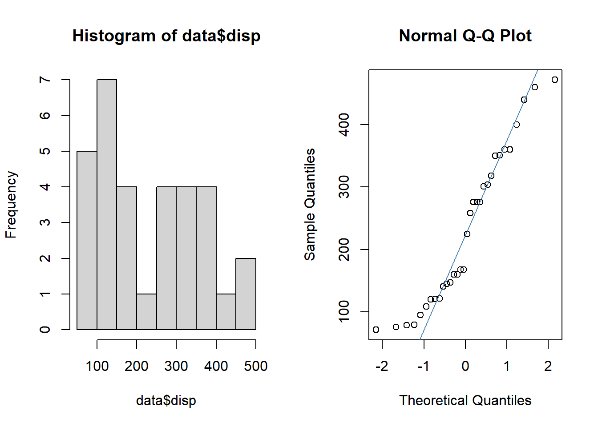

Once you have installed R and Rstudio, we can get started with R!
&nbsp;

**IMPORTANT** : R is case sensitive. This means that `mean(variable)` is not the same as `Mean(variable)`!
&nbsp;

## Overview 

The topics in this document are:

* [Packages](#packages) 

* [Importing data sets](#importing)

* [Datamanagement](#datamanagement)

* [Graphs](#graphs)

* [Descriptives](#descriptives)

* [Statistical tests](#tests)

* [Regression](#regression)

* [Save your work](#saving)

&nbsp;
&nbsp;

## Packages {#packages}


For a lot of R functions, additional libraries need to be loaded.

This can be done with:


```r
library(lattice)
```

Sometimes the library needs to be installed first:


```r
install.packages(lattice)
library(lattice)
```

*Installing* a library only needs to be done once. *Loading* the library must be done every time you start R. 

&nbsp;
&nbsp;

## Importing data sets {#importing}

How do I get my data in R?


#### SPSS file

1) Load the library foreign

```r
library(foreign)
```

2) Load data from spss using the function read.spss

```r
data <- read.spss("C:/Documents/data.sav", to.data.frame = TRUE)
```
&nbsp;

#### Excel file

1) Load the library readxl

```r
library(readxl)
```

2) Load data from spss using the function read_excel

```r
data <- read_excel("C:/Documents/data.xlsx")
```

&nbsp;

**Note 1** For R to recognize the folder you need to use forward slashes (`/`) instead of backward slashes (`\`)

**Note 2** Pay attention to the name you give your data set. You want it to be distinct, but don't make it too long!

&nbsp;

#### Importing data with the menu
Data can also be loaded via the menu. Go to File -> Import Dataset -> choose your filetype.

&nbsp;
&nbsp;

## Datamanagement {#datamanagement}
We  want to investigate and explore the data set before we perform our analyses. Often we also need to perform some data manipulation steps first.

#### Explore data
Let's explore a dataset.

We will use a standard data set available in R (mtcars). I will name this dataset "data"

```r
data(mtcars)
data <- mtcars
```

With the function `head`, we can print the first couple of rows; check out the names of the variables and the first entries.


```r
head(data)
```

```
##                    mpg cyl disp  hp drat    wt  qsec vs am gear carb
## Mazda RX4         21.0   6  160 110 3.90 2.620 16.46  0  1    4    4
## Mazda RX4 Wag     21.0   6  160 110 3.90 2.875 17.02  0  1    4    4
## Datsun 710        22.8   4  108  93 3.85 2.320 18.61  1  1    4    1
## Hornet 4 Drive    21.4   6  258 110 3.08 3.215 19.44  1  0    3    1
## Hornet Sportabout 18.7   8  360 175 3.15 3.440 17.02  0  0    3    2
## Valiant           18.1   6  225 105 2.76 3.460 20.22  1  0    3    1
```
&nbsp;

##### Obtain the summaries of each variable
The numbers of missings `NA` are also reported.

```r
summary(data)
```

```
##       mpg             cyl             disp             hp       
##  Min.   :10.40   Min.   :4.000   Min.   : 71.1   Min.   : 52.0  
##  1st Qu.:15.43   1st Qu.:4.000   1st Qu.:120.8   1st Qu.: 96.5  
##  Median :19.20   Median :6.000   Median :196.3   Median :123.0  
##  Mean   :20.09   Mean   :6.188   Mean   :230.7   Mean   :146.7  
##  3rd Qu.:22.80   3rd Qu.:8.000   3rd Qu.:326.0   3rd Qu.:180.0  
##  Max.   :33.90   Max.   :8.000   Max.   :472.0   Max.   :335.0  
##       drat             wt             qsec             vs        
##  Min.   :2.760   Min.   :1.513   Min.   :14.50   Min.   :0.0000  
##  1st Qu.:3.080   1st Qu.:2.581   1st Qu.:16.89   1st Qu.:0.0000  
##  Median :3.695   Median :3.325   Median :17.71   Median :0.0000  
##  Mean   :3.597   Mean   :3.217   Mean   :17.85   Mean   :0.4375  
##  3rd Qu.:3.920   3rd Qu.:3.610   3rd Qu.:18.90   3rd Qu.:1.0000  
##  Max.   :4.930   Max.   :5.424   Max.   :22.90   Max.   :1.0000  
##        am              gear            carb      
##  Min.   :0.0000   Min.   :3.000   Min.   :1.000  
##  1st Qu.:0.0000   1st Qu.:3.000   1st Qu.:2.000  
##  Median :0.0000   Median :4.000   Median :2.000  
##  Mean   :0.4062   Mean   :3.688   Mean   :2.812  
##  3rd Qu.:1.0000   3rd Qu.:4.000   3rd Qu.:4.000  
##  Max.   :1.0000   Max.   :5.000   Max.   :8.000
```
&nbsp;

##### Obtain the summaries of one variable
With the `$` symbol we access a variable in a data set.

```r
summary(data$mpg)
```

```
##    Min. 1st Qu.  Median    Mean 3rd Qu.    Max. 
##   10.40   15.43   19.20   20.09   22.80   33.90
```
&nbsp;

#####  Obtain the variable names 

```r
names(data)
```

```
##  [1] "mpg"  "cyl"  "disp" "hp"   "drat" "wt"   "qsec" "vs"   "am"   "gear"
## [11] "carb"
```
&nbsp;

#####  Look at the type of variables in the data:

Numeric - Factor - character - Integer - etc

```r
str(data)
```

```
## 'data.frame':	32 obs. of  11 variables:
##  $ mpg : num  21 21 22.8 21.4 18.7 18.1 14.3 24.4 22.8 19.2 ...
##  $ cyl : num  6 6 4 6 8 6 8 4 4 6 ...
##  $ disp: num  160 160 108 258 360 ...
##  $ hp  : num  110 110 93 110 175 105 245 62 95 123 ...
##  $ drat: num  3.9 3.9 3.85 3.08 3.15 2.76 3.21 3.69 3.92 3.92 ...
##  $ wt  : num  2.62 2.88 2.32 3.21 3.44 ...
##  $ qsec: num  16.5 17 18.6 19.4 17 ...
##  $ vs  : num  0 0 1 1 0 1 0 1 1 1 ...
##  $ am  : num  1 1 1 0 0 0 0 0 0 0 ...
##  $ gear: num  4 4 4 3 3 3 3 4 4 4 ...
##  $ carb: num  4 4 1 1 2 1 4 2 2 4 ...
```
&nbsp;

#### Basic data manipulation

##### Rename variables

```r
names(data)[names(data) == "carb"] <- "CARB"
```
&nbsp;

##### Make a subset of your data
**Tip! ** Create a new data set with a new name. Otherwise you might lose important information in your data.

Remove observations with missings (`NA`) in "mpg" and "cyl"

```r
data2 <- subset(data, !is.na(data$mpg) & !is.na(data$cyl))
```
&nbsp;

#####  Remove observation above a certain threshold
Make a new dataset, including only mpg values > 20. (Don't forget the comma in the code!)

```r
data2 <- data[data$mpg > 20, ]
```
&nbsp;

##### Remove duplicates
This can be used if there are multiple measurement per patient, but you want to keep only the first.

```r
data.short <- data[!duplicated(data$gear),]
```
&nbsp;

##### Remove variables

```r
data2 <- subset(data, select = -c(mpg, cyl))
```
&nbsp;

#####  Keep variables

```r
data2 <- subset(data, select = c(mpg, cyl))
```
&nbsp;
&nbsp;

## Graphs {#graphs}

Make a simple histogram (mpg = continuous variable)


```r
hist(data$mpg)
```


Make a simple scatter plot (mpg & disp = continuous variables)

```r
plot(data$mpg ~ data$disp)
```


Make a simple boxplot (mpg = continuous variable, cyl = categorical variable)

```r
boxplot(data$mpg ~ data$cyl)
```


Improve the scatterplot by changing the color, adding a title, etc. 


```r
plot(data$mpg ~ mtcars$disp, xlab = "Disp", ylab = "Mpg", 
     xlim = c(75, 475), ylim = c(10, 35),
     main = "Scatterplot Mpg - Disp", col = "red", pch = 20, cex = 1.5)
```


For two plots next to each other we can use the function `par(mfrow = c(1,2))`


```r
par(mfrow = c(1,2))
plot(data$mpg ~ data$disp)
plot(data$mpg ~ mtcars$disp, xlab = "Disp", ylab = "Mpg", 
     xlim = c(75, 475), ylim = c(10, 35),
     main = "Scatterplot Mpg - Disp", col = "red", pch = 20, cex = 1.5)
```


&nbsp;

&nbsp;

## Descriptives {#descriptives}

##### Obtain descriptives for continuous variables

mean (sd)

```r
mean(data$mpg)
```

```
## [1] 20.09062
```

```r
sd(data$mpg)
```

```
## [1] 6.026948
```

median (IQR)

```r
median(data$mpg)
```

```
## [1] 19.2
```

```r
quantile(data$mpg, probs = c(0.25, 0.75))
```

```
##    25%    75% 
## 15.425 22.800
```
&nbsp;

##### Obtain descriptives for categorical variables

Frequencies

```r
table(data$cyl)
```

```
## 
##  4  6  8 
## 11  7 14
```

Crosstabs

```r
table(data$cyl, data$vs)
```

```
##    
##      0  1
##   4  1 10
##   6  3  4
##   8 14  0
```

&nbsp;
&nbsp;

## Statistical tests {#tests}


#### T-test
With a t-test, we compare a normally distributed continuous variable between two groups. 
In the data "am" is a grouping variable (0/1). Let's explore this variable with `table`:

```r
table(data$am)
```

```
## 
##  0  1 
## 19 13
```

"drat" is a continuous variable. Is it normally distributed?


```r
par(mfrow = c(1,2))
hist(data$drat)
qqnorm(data$drat)
qqline(data$drat, col = "steelblue")
```


This looks pretty normal, so we can use a t-test to analyze these data. 


```r
t.test(drat ~ am, data = data)
```

```
## 
## 	Welch Two Sample t-test
## 
## data:  drat by am
## t = -5.6461, df = 27.198, p-value = 5.267e-06
## alternative hypothesis: true difference in means between group 0 and group 1 is not equal to 0
## 95 percent confidence interval:
##  -1.0411183 -0.4862501
## sample estimates:
## mean in group 0 mean in group 1 
##        3.286316        4.050000
```

The output provides us with the p-value of the test, but also the 95\% confidence interval and the mean in both groups. 

It is possible to save the test as an r object (named "test") and extract the p-value from it.

```r
test <- t.test(drat ~ am, data = data)
test$p.value
```

```
## [1] 5.266742e-06
```
&nbsp;

#### Mann-Whitney U test
When the continuous variable is not normally distributed, we use the Mann-Whitney U test (or Wilcoxon Rank Sum test). The variable "mpg" is not normally distributed as we can see by the graphs.


```r
par(mfrow = c(1,2))
hist(data$disp)
qqnorm(data$disp)
qqline(data$disp, col = "steelblue")
```


So, we use the code `wilcox.test`


```r
wilcox.test(disp ~ am, data = data)
```

```
## 
## 	Wilcoxon rank sum test with continuity correction
## 
## data:  disp by am
## W = 214, p-value = 0.0005493
## alternative hypothesis: true location shift is not equal to 0
```
The p-value is <0.05, so we can reject H0.
&nbsp;

#### ANOVA
When we want to compare a continuous variable in more than 2 groups, we can use an ANOVA. For this test, we assume that the continuous marker follows a normal distribution. The variable "gear" has three groups:


```r
table(data$gear)
```

```
## 
##  3  4  5 
## 15 12  5
```

We will use ANOVA to test if "drat" is similar over the "gear" groups. We visualize the data first:


```r
boxplot(data$drat ~ data$gear)
```



There appears to be a big difference, especially in group 3. 
For the ANOVA procedure in R it is better if the grouping variable is a "factor" instead of "numeric", so we make a new variable: gear.factor.

```r
str(data$gear)
```

```
##  num [1:32] 4 4 4 3 3 3 3 4 4 4 ...
```

```r
data$gear.factor <- as.factor(data$gear)

str(data$gear.factor)
```

```
##  Factor w/ 3 levels "3","4","5": 2 2 2 1 1 1 1 2 2 2 ...
```


```r
aov1 <- aov(drat ~ gear.factor, data = data)
summary(aov1)
```

```
##             Df Sum Sq Mean Sq F value   Pr(>F)    
## gear.factor  2  6.133  3.0667   32.59 3.82e-08 ***
## Residuals   29  2.729  0.0941                     
## ---
## Signif. codes:  0 '***' 0.001 '**' 0.01 '*' 0.05 '.' 0.1 ' ' 1
```

The p-value is highly significant. We can perform a post-hoc test, to see which groups are different from each other. With Tukey we adjust the p-value to correct for multiple testing.


```r
TukeyHSD(aov1)
```

```
##   Tukey multiple comparisons of means
##     95% family-wise confidence level
## 
## Fit: aov(formula = drat ~ gear.factor, data = data)
## 
## $gear.factor
##           diff        lwr       upr     p adj
## 4-3  0.9106667  0.6172574 1.2040759 0.0000001
## 5-3  0.7833333  0.3921210 1.1745457 0.0000856
## 5-4 -0.1273333 -0.5305858 0.2759191 0.7181847
```

Group 3 is indeed different from 4 and 5. 
&nbsp;

#### Kruskal-Wallis test
The non-paramtric version of the ANOVA is the Kruskal-Wallis test. 


```r
boxplot(data$disp ~ data$gear.factor)
```


```r
kruskal.test(disp ~ gear.factor, data = data)
```

```
## 
## 	Kruskal-Wallis rank sum test
## 
## data:  disp by gear.factor
## Kruskal-Wallis chi-squared = 16.578, df = 2, p-value = 0.0002513
```

The groups of gear are also significantly different for disp values.

&nbsp;

#### Correlations
Correlations are used for two continuous variables. We already made a scatterplot of "mpg" and "disp".


```r
plot(data$mpg ~ data$disp)
```


There seems to be a strong negative correlation between the variables. Is it significant?


```r
cor.test(data$disp, data$mpg, method = "spearman")
```

```
## Warning in cor.test.default(data$disp, data$mpg, method = "spearman"): Cannot
## compute exact p-value with ties
```

```
## 
## 	Spearman's rank correlation rho
## 
## data:  data$disp and data$mpg
## S = 10415, p-value = 6.37e-13
## alternative hypothesis: true rho is not equal to 0
## sample estimates:
##        rho 
## -0.9088824
```
Since "mpg" is not normally distributed, we use the `method = "spearman"` version of the test. For the Pearson correlation, use `method = "pearson"`.
The correlation is -0.9 and highly significant. 

## Regression {#regression}

Coming soon!

&nbsp;
&nbsp;

## Saving your work {#saving}

Coming soon!
