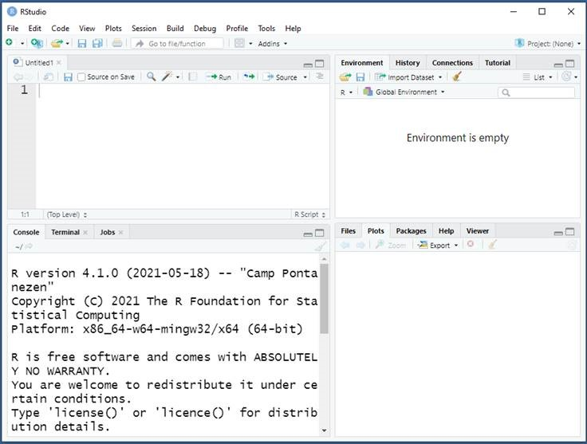

```{r setup, include=FALSE}
library(knitr)
opts_chunk$set(echo = TRUE)
```

### Learn  R here!

R is an open source statistical software package used often in data analysis. It is a little more complex to use than SPSS, because it is mainly syntax or code based. However, R is more flexible and powerful than SPSS. So, it is definitely worth the effort to get the hang of it.

In this web page, I will explain the basic steps to get you started with R. I will also make a document with some more advanced methods. 

Good luck!

Sara Baart - 29-12-2021
s.baart@erasmusmc.nl

## Installing the software
### R
R is free to install and can be downloaded here: https://www.r-project.org/. Click on **download R** and choose a CRAN mirror (Netherlands for example, but this doesn't really matter.)

### RStudio
Although R is the software that does all the calculations, we will work with the program RStudio. You can download RStudio here: https://www.rstudio.com/products/rstudio/download/ (choose the free desktop version)

When you have installed it, Rstudio should look something like this:

```{r Rstudio, echo = FALSE}

```

## Tutorials
[Start with the basics](LearnR.html)

[Advanced options](LearnR2.html)