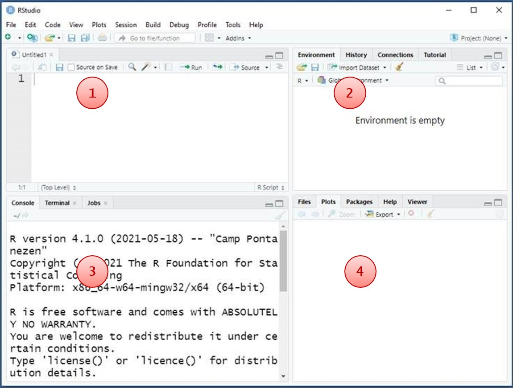

```{r setup, include=FALSE}
library(knitr)
opts_chunk$set(echo = TRUE)
```
&nbsp;


R is an open source statistical software package used often in data analysis. It is a little more complex to use than SPSS, because it is mainly syntax (code) based. However, R is more flexible and powerful than SPSS. So, it is definitely worth the effort to get the hang of.

In this web page, I will explain the basic steps to get you started with R. I will also make a document with some more advanced methods. 

Good luck!

Sara Baart - 29-12-2021
s.baart@erasmusmc.nl

&nbsp;
&nbsp;

## Installing the software
### R
R is free to install and can be downloaded here: https://www.r-project.org/. Click on **download R** and choose a CRAN mirror (Netherlands for example, but this doesn't really matter) and install R for your operating system.
&nbsp;

### RStudio
You also need to install Rstudio. R and Rstudio are connected with each other; R does the calculations in the background and we work with Rstudio, which is more user friendly. You can download RStudio here: https://www.rstudio.com/products/rstudio/download/ (choose the free desktop version).

When you have installed it, Rstudio should look something like this:

```{r Rstudio, echo = FALSE}
include_graphics("Rstudio.jpg")
```
&nbsp;

The Rstudio screen consists of four panes:

```{r , echo = FALSE}

```
&nbsp;

Explanation: 

1) This is your **code editor** or **script**. Here you type your code; you can save this file as an .R document.

2) The **environment**. All your R objects are displayed here (datasets, models, vectors, functions, etc.)

3) The **console**, where you find the results of your analyses.

4) Plots are displayed here. The tabs **packages** and **help** provide information about packages and functions.

&nbsp;

Now you are ready to start with R:

### Guides
[Getting started](LearnR.html)

[Advanced options](LearnR2.html)